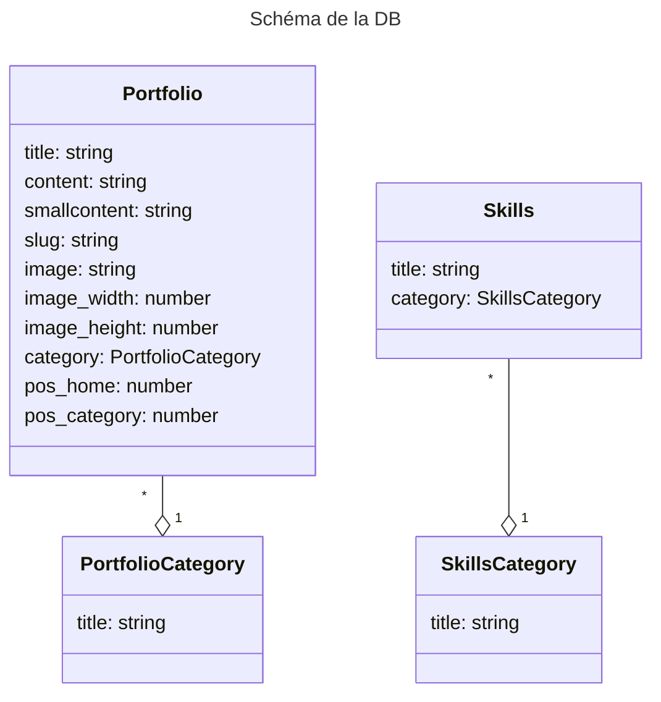

# Portfolio

## Prisma

- Init prisma : `npx prisma init --datasource-provider sqlite`
- Générer migration `npx prisma migrate dev`

## Theme color:

```
https://www.realtimecolors.com/?colors=ebf4f6-091619-9bd9e3-1f8393-40cde3
$text: #ebf4f6;
$background: #091619;
$primary: #9bd9e3;
$secondary: #1f8393;
$accent: #40cde3;
```

## Schéma DB


