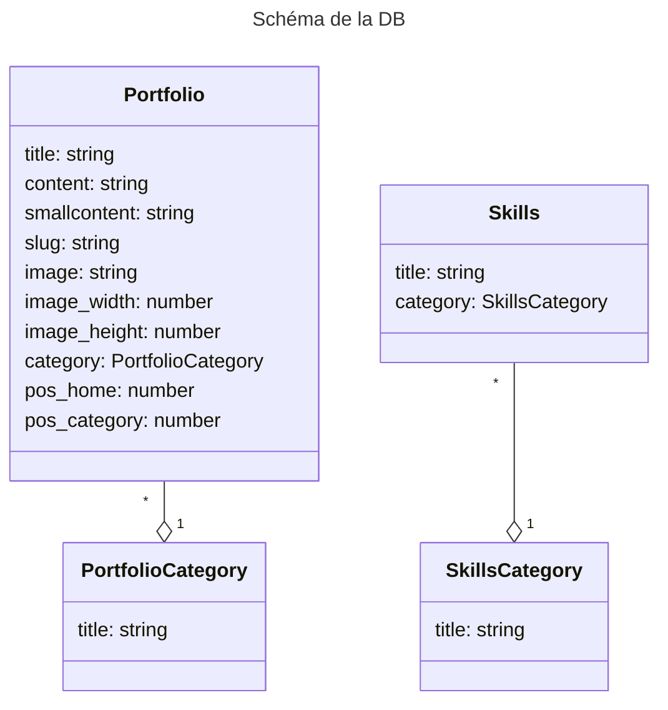

# Portfolio

## Prisma

* Init prisma : ```npx prisma init --datasource-provider sqlite```
* Générer migration ```npx prisma migrate dev```

## Schéma DB


```mermaid
  ---
title: Schéma de la DB
---
classDiagram
class PortfolioCategory {
  title: string
}
class Portfolio {
  title: string
  content: string
  smallcontent: string
  slug: string
  image: string
  image_width: number
  image_height: number
  category: PortfolioCategory
  pos_home: number
  pos_category: number
}
class SkillsCategory {
  title: string
}
class Skills {
  title: string
  category: SkillsCategory
}

Skills "*" --o "1" SkillsCategory
Portfolio "*" --o "1" PortfolioCategory

```
